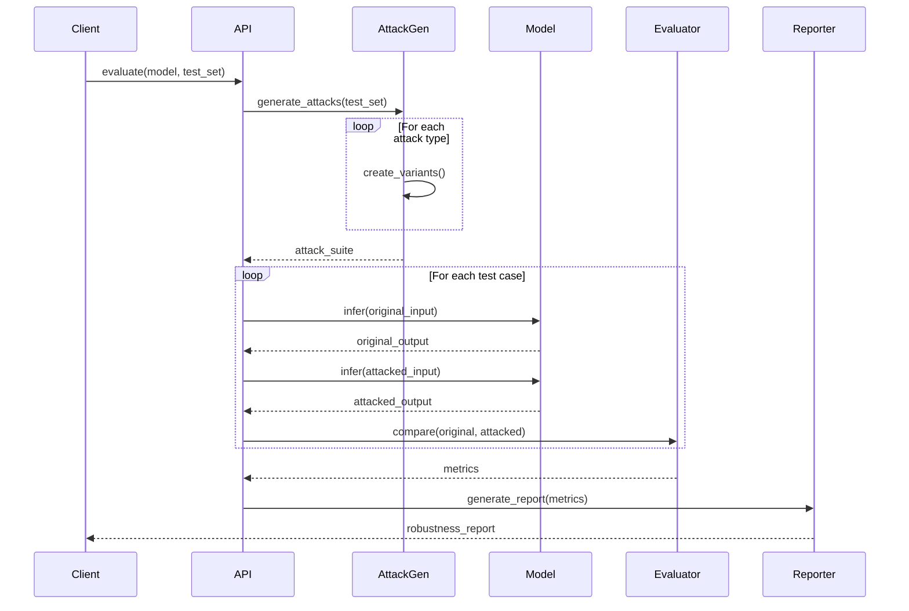

# CrucibleAdversary Architecture

## Overview

CrucibleAdversary is designed as a modular, extensible framework for adversarial testing and robustness evaluation of AI models. The architecture follows a layered approach with clear separation of concerns.

## System Architecture

```mermaid
graph TB
    subgraph "Client Layer"
        API[Main API]
        CLI[CLI Interface]
        Pipeline[Pipeline Integration]
    end

    subgraph "Attack Layer"
        Pert[Perturbations]
        Inj[Injection Attacks]
        Jail[Jailbreak Attacks]
        Extr[Extraction Attacks]
        Custom[Custom Attacks]
    end

    subgraph "Evaluation Layer"
        Rob[Robustness Evaluator]
        Sec[Security Scanner]
        Stress[Stress Tester]
        Metrics[Metrics Engine]
    end

    subgraph "Defense Layer"
        Detect[Attack Detection]
        Filter[Input Filtering]
        Sanit[Sanitization]
    end

    subgraph "Core Services"
        Gen[Attack Generators]
        Mut[Mutation Engine]
        Rep[Reporting]
        Store[Result Storage]
    end

    API --> Attack Layer
    API --> Evaluation Layer
    API --> Defense Layer

    Attack Layer --> Core Services
    Evaluation Layer --> Core Services
    Defense Layer --> Core Services

    Core Services --> Rep
```

## Component Overview

### 1. Attack Layer

The attack layer implements various adversarial attack strategies:

#### Perturbations Module
- **Character-level**: Typos, swaps, homoglyphs
- **Word-level**: Synonyms, insertions, deletions
- **Sentence-level**: Paraphrasing, reordering

#### Injection Attacks
- **Basic Injection**: Direct instruction override
- **Context Overflow**: Context window exploitation
- **Delimiter Attacks**: Delimiter confusion techniques
- **Template Injection**: Prompt template exploitation

#### Jailbreak Techniques
- **Role-playing**: Persona-based bypass strategies
- **Context Switching**: Dynamic context manipulation
- **Encoding Tricks**: Obfuscation methods (base64, ROT13, etc.)
- **Hypothetical Scenarios**: "What if" based attacks

### 2. Evaluation Layer

#### Robustness Evaluator
```elixir
defmodule CrucibleAdversary.Robustness do
  @moduledoc """
  Evaluates model robustness across multiple attack vectors.
  Provides comprehensive robustness scoring and analysis.
  """

  def evaluate(model, test_set, opts) do
    # Execute attacks
    # Measure performance degradation
    # Calculate robustness metrics
    # Generate recommendations
  end
end
```

#### Security Scanner
- Automated vulnerability detection
- OWASP-style security testing
- Compliance checking
- Risk assessment

#### Stress Tester
- High-volume attack simulation
- Concurrent request handling
- Performance under adversarial load
- Stability analysis

### 3. Defense Layer

#### Attack Detection
```elixir
defmodule CrucibleAdversary.Defenses.Detection do
  @moduledoc """
  Multi-layer attack detection system.
  """

  def detect(input, opts) do
    # Pattern-based detection
    # Anomaly detection
    # Entropy analysis
    # ML-based classification
  end
end
```

#### Input Filtering
- Delimiter normalization
- Special character filtering
- Length limiting
- Content sanitization

### 4. Core Services

#### Attack Generators
- Dynamic attack generation
- Mutation-based testing
- Evolutionary attack strategies
- Adaptive attack creation

#### Mutation Engine
```elixir
defmodule CrucibleAdversary.Generators.MutationEngine do
  @moduledoc """
  Core mutation engine for adversarial example generation.
  """

  defstruct [
    :mutation_rate,
    :mutation_strategies,
    :constraints,
    :fitness_function
  ]

  def mutate(input, strategy, opts) do
    # Apply mutations
    # Validate constraints
    # Evaluate fitness
    # Return mutated variants
  end
end
```

## Data Flow



## Module Organization

```
lib/crucible_adversary/
├── adversary.ex                 # Main API and coordination
├── config.ex                    # Configuration management
│
├── attacks/                     # Attack implementations
│   ├── attack.ex               # Base attack behavior
│   ├── injection.ex
│   ├── jailbreak.ex
│   ├── extraction.ex
│   └── bias.ex
│
├── perturbations/              # Text perturbation strategies
│   ├── character.ex
│   ├── word.ex
│   └── semantic.ex
│
├── evaluation/                 # Evaluation systems
│   ├── robustness.ex
│   ├── security.ex
│   └── stress.ex
│
├── defenses/                   # Defense mechanisms
│   ├── detection.ex
│   ├── filtering.ex
│   └── sanitization.ex
│
├── generators/                 # Attack generation
│   ├── text_generator.ex
│   ├── prompt_generator.ex
│   └── mutation_engine.ex
│
├── metrics/                    # Robustness metrics
│   ├── accuracy.ex
│   ├── consistency.ex
│   ├── certified.ex
│   └── asr.ex
│
└── reports/                    # Reporting and export
    ├── robustness_report.ex
    ├── security_report.ex
    └── export.ex
```

## Key Design Patterns

### 1. Strategy Pattern for Attacks

```elixir
defmodule CrucibleAdversary.Attack do
  @callback generate(input :: String.t(), opts :: keyword()) :: AttackResult.t()
  @callback success_criteria(result :: any()) :: boolean()

  defmacro __using__(_opts) do
    quote do
      @behaviour CrucibleAdversary.Attack

      def attack_type, do: __MODULE__

      defoverridable [attack_type: 0]
    end
  end
end
```

### 2. Pipeline Pattern for Evaluation

```elixir
defmodule CrucibleAdversary.Pipeline do
  defstruct [:stages, :context]

  def new, do: %__MODULE__{stages: [], context: %{}}

  def add_stage(pipeline, name, fun) do
    %{pipeline | stages: pipeline.stages ++ [{name, fun}]}
  end

  def run(pipeline, input) do
    Enum.reduce(pipeline.stages, input, fn {_name, fun}, acc ->
      fun.(acc, pipeline.context)
    end)
  end
end
```

### 3. Observer Pattern for Monitoring

```elixir
defmodule CrucibleAdversary.Monitor do
  use GenServer

  def start_link(opts) do
    GenServer.start_link(__MODULE__, opts, name: __MODULE__)
  end

  def notify(event) do
    GenServer.cast(__MODULE__, {:event, event})
  end

  # Callbacks handle event distribution to subscribers
end
```

## Integration Points

### With CrucibleBench

```elixir
# Statistical comparison of robustness
benchmark_results = CrucibleBench.compare_multiple(
  robustness_scores,
  labels: model_names
)
```

### With Crucible Core

```elixir
# Pipeline integration
pipeline = Crucible.Pipeline.new()
|> Crucible.Pipeline.add_stage(:adversarial_test,
     &CrucibleAdversary.evaluate/1)
```

### With External Systems

- **Observability**: OpenTelemetry integration
- **Storage**: Pluggable backends (ETS, PostgreSQL, S3)
- **ML Models**: Generic adapter interface

## Scalability Considerations

### Horizontal Scaling

```elixir
# Distributed attack execution
defmodule CrucibleAdversary.Distributed do
  def evaluate_distributed(model, test_set, nodes) do
    test_set
    |> Enum.chunk_every(div(length(test_set), length(nodes)))
    |> Enum.zip(nodes)
    |> Enum.map(fn {chunk, node} ->
      Task.Supervisor.async({CrucibleAdversary.TaskSup, node}, fn ->
        CrucibleAdversary.evaluate(model, chunk)
      end)
    end)
    |> Task.await_many()
    |> merge_results()
  end
end
```

### Caching Strategy

- Attack result caching (ETS)
- Model response caching (optional)
- Metric computation caching

### Resource Management

- Concurrent request limiting
- Memory usage monitoring
- Timeout management

## Security Considerations

### Input Validation

All user inputs are validated and sanitized before processing to prevent:
- Code injection
- Path traversal
- Resource exhaustion

### Output Safety

Attack generation is controlled to prevent:
- Generation of actually harmful content
- Unintended side effects
- Data leakage

### Audit Logging

All attacks and evaluations are logged for:
- Security auditing
- Reproducibility
- Compliance

## Performance Characteristics

### Complexity Analysis

| Operation | Time Complexity | Space Complexity |
|-----------|----------------|------------------|
| Character Perturbation | O(n) | O(n) |
| Injection Attack | O(1) | O(1) |
| Robustness Evaluation | O(k * n * m) | O(n * m) |
| Security Scan | O(k * n) | O(n) |

Where:
- n = size of test set
- m = number of attack types
- k = average attack variants per input

### Benchmarks

Target performance metrics:
- Single attack generation: < 10ms
- Batch evaluation (100 samples): < 5s
- Security scan: < 30s for standard suite
- Stress test: Sustained 1000 req/s

## Extension Points

### Custom Attack Development

```elixir
defmodule MyCompany.CustomAttack do
  use CrucibleAdversary.Attack

  @impl true
  def generate(input, opts) do
    # Custom implementation
  end

  @impl true
  def success_criteria(result) do
    # Custom success logic
  end
end

# Register custom attack
CrucibleAdversary.register_attack(MyCompany.CustomAttack)
```

### Custom Metrics

```elixir
defmodule MyCompany.CustomMetric do
  @behaviour CrucibleAdversary.Metric

  @impl true
  def calculate(original, attacked) do
    # Custom metric calculation
  end
end
```

## Future Architecture Enhancements

1. **Plugin System**: Hot-loadable attack modules
2. **Real-time Monitoring**: Live dashboards and alerts
3. **Automated Defense Generation**: ML-based defense synthesis
4. **Cross-framework Support**: Adapters for TensorFlow, PyTorch models
5. **Cloud-native Deployment**: Kubernetes operators and scaling
