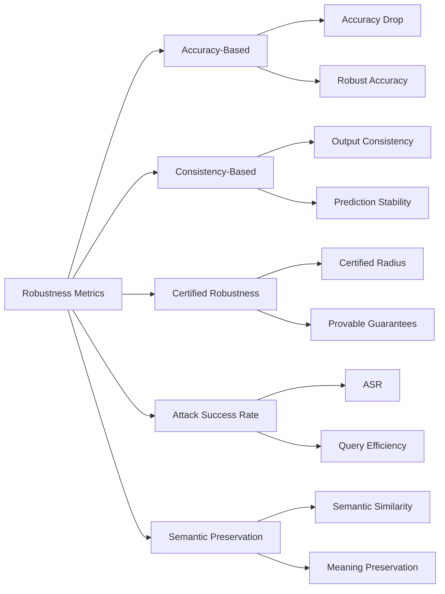

# Robustness Metrics

## Overview

This document describes the comprehensive suite of robustness metrics used by CrucibleAdversary to quantify model resilience against adversarial attacks.

## Metric Categories



## Accuracy-Based Metrics

### 1. Accuracy Drop

**Definition**: Decrease in accuracy when evaluated on adversarial examples vs. clean examples.

```elixir
accuracy_drop = CrucibleAdversary.Metrics.accuracy_drop(
  original_results: baseline_results,
  attacked_results: adversarial_results
)

# Returns:
%{
  original_accuracy: 0.95,
  attacked_accuracy: 0.78,
  absolute_drop: 0.17,      # 95% - 78%
  relative_drop: 0.179,     # (95 - 78) / 95
  severity: :moderate
}
```

**Interpretation**:
- **< 5%**: Highly robust
- **5-15%**: Moderately robust
- **15-30%**: Low robustness
- **> 30%**: Vulnerable

**Formula**:
```
Accuracy_Drop = Acc_clean - Acc_adversarial
Relative_Drop = (Acc_clean - Acc_adversarial) / Acc_clean
```

### 2. Robust Accuracy

**Definition**: Accuracy on adversarial examples only.

```elixir
robust_acc = CrucibleAdversary.Metrics.robust_accuracy(
  predictions: adversarial_predictions,
  ground_truth: labels
)

# Returns: 0.78
```

**Benchmark Values**:
- **> 90%**: Excellent robustness
- **80-90%**: Good robustness
- **70-80%**: Acceptable robustness
- **< 70%**: Poor robustness

## Consistency-Based Metrics

### 3. Output Consistency

**Definition**: Similarity between outputs on clean and perturbed inputs.

```elixir
consistency = CrucibleAdversary.Metrics.consistency(
  original_outputs: clean_outputs,
  perturbed_outputs: attacked_outputs,
  method: :cosine_similarity
)

# Returns:
%{
  mean_consistency: 0.87,
  median_consistency: 0.91,
  std_consistency: 0.12,
  distribution: histogram_data
}
```

**Methods**:
- **Cosine Similarity**: For embedding-based comparison
- **Edit Distance**: For text comparison
- **Semantic Similarity**: Using sentence transformers

**Interpretation**:
- **> 0.9**: Very consistent (robust)
- **0.7-0.9**: Moderately consistent
- **0.5-0.7**: Low consistency
- **< 0.5**: Inconsistent (vulnerable)

### 4. Prediction Stability

**Definition**: Variance in predictions under perturbations.

```elixir
stability = CrucibleAdversary.Metrics.prediction_stability(
  model: model,
  input: sample,
  perturbations: 100,
  perturbation_type: :random
)

# Returns:
%{
  stability_score: 0.92,
  entropy: 0.23,
  flip_rate: 0.08,  # Fraction of flipped predictions
  confidence_variance: 0.015
}
```

**Formula**:
```
Stability = 1 - (num_prediction_changes / num_perturbations)
```

## Attack Success Rate (ASR)

### 5. Attack Success Rate

**Definition**: Percentage of attacks that successfully fool the model.

```elixir
asr = CrucibleAdversary.Metrics.attack_success_rate(
  attacks: attack_results,
  success_criteria: &success_criterion/1
)

# Returns:
%{
  overall_asr: 0.23,
  by_attack_type: %{
    character_swap: 0.15,
    injection: 0.34,
    jailbreak: 0.42
  },
  severity: :moderate
}
```

**Success Criteria Examples**:
```elixir
# For classification
def success_criterion(result) do
  result.predicted_class != result.true_class
end

# For safety
def success_criterion(result) do
  result.safety_score < 0.5
end

# For extraction
def success_criterion(result) do
  result.contains_sensitive_data?
end
```

**Interpretation**:
- **< 10%**: Highly robust
- **10-25%**: Moderately robust
- **25-50%**: Vulnerable
- **> 50%**: Highly vulnerable

### 6. Query Efficiency

**Definition**: Number of queries needed for successful attack.

```elixir
efficiency = CrucibleAdversary.Metrics.query_efficiency(
  attack_results: results,
  total_queries: 10000
)

# Returns:
%{
  mean_queries_to_success: 47.3,
  median_queries_to_success: 32,
  success_rate: 0.67,
  efficiency_score: 0.67 / 47.3  # Success per query
}
```

**Lower is worse for defender**: Easier to attack

## Semantic Preservation

### 7. Semantic Similarity

**Definition**: Degree to which adversarial examples preserve original meaning.

```elixir
similarity = CrucibleAdversary.Metrics.semantic_similarity(
  original: "The cat sat on the mat",
  perturbed: "The feline rested on the rug",
  method: :sentence_transformers
)

# Returns:
%{
  similarity_score: 0.94,
  method: :sentence_transformers,
  embedding_model: "all-MiniLM-L6-v2"
}
```

**Methods**:
1. **Sentence Transformers**: Embedding-based similarity
2. **BLEU Score**: N-gram overlap
3. **BERTScore**: Contextualized similarity
4. **Word Mover's Distance**: Semantic distance

**Interpretation** (for valid perturbation attacks):
- **> 0.9**: Excellent semantic preservation
- **0.8-0.9**: Good preservation
- **0.7-0.8**: Acceptable preservation
- **< 0.7**: Meaning changed (invalid attack)

### 8. Meaning Preservation Rate

**Definition**: Percentage of adversarial examples that preserve original meaning.

```elixir
preservation = CrucibleAdversary.Metrics.meaning_preservation_rate(
  original_texts: originals,
  perturbed_texts: perturbations,
  threshold: 0.85
)

# Returns: 0.92 (92% of perturbations preserved meaning)
```

## Certified Robustness

### 9. Certified Robustness Radius

**Definition**: Provable robustness guarantee within a specified radius.

```elixir
cert_robust = CrucibleAdversary.Metrics.certified_robustness(
  model: model,
  input: sample,
  method: :randomized_smoothing,
  confidence: 0.95
)

# Returns:
%{
  certified_radius: 2.3,
  confidence: 0.95,
  method: :randomized_smoothing,
  base_prediction: "class_a",
  is_certified: true
}
```

**Methods**:
- **Randomized Smoothing**: Probabilistic certification
- **Interval Bound Propagation**: Deterministic bounds
- **CROWN**: Efficient certified defense

**Interpretation**: Within the certified radius, predictions are provably robust.

### 10. Provable Accuracy

**Definition**: Accuracy with provable robustness guarantees.

```elixir
provable_acc = CrucibleAdversary.Metrics.provable_accuracy(
  model: model,
  test_set: test_data,
  perturbation_budget: 0.1,
  method: :interval_bound_propagation
)

# Returns: 0.83 (83% have provable correct predictions)
```

## Composite Metrics

### 11. Adversarial Robustness Score (ARS)

**Definition**: Composite metric combining multiple robustness aspects.

```elixir
ars = CrucibleAdversary.Metrics.adversarial_robustness_score(
  model: model,
  test_set: test_data,
  attack_suite: :comprehensive
)

# Returns:
%{
  overall_score: 0.78,
  components: %{
    robust_accuracy: 0.82,
    consistency: 0.89,
    asr_resistance: 0.77,  # 1 - ASR
    semantic_preservation: 0.94
  },
  grade: :B,
  percentile: 73
}
```

**Formula**:
```
ARS = (w1 * RobustAcc + w2 * Consistency + w3 * (1 - ASR) + w4 * SemPres) / sum(weights)
```

Default weights: `w1=0.3, w2=0.3, w3=0.3, w4=0.1`

**Grading Scale**:
- **A (≥ 0.90)**: Excellent robustness
- **B (0.80-0.89)**: Good robustness
- **C (0.70-0.79)**: Acceptable robustness
- **D (0.60-0.69)**: Poor robustness
- **F (< 0.60)**: Failing robustness

### 12. Security Vulnerability Score

**Definition**: Quantifies security vulnerabilities discovered.

```elixir
vuln_score = CrucibleAdversary.Metrics.vulnerability_score(
  scan_results: security_scan
)

# Returns:
%{
  score: 6.8,  # 0-10 scale, lower is better
  severity_breakdown: %{
    critical: 1,
    high: 2,
    medium: 3,
    low: 5
  },
  cvss_score: 6.8,
  risk_level: :high
}
```

**Scoring**:
```
Score = (10 * critical + 7 * high + 4 * medium + 1 * low) / max_possible
```

## Task-Specific Metrics

### Classification Tasks

```elixir
classification_metrics = CrucibleAdversary.Metrics.classification_robustness(
  model: classifier,
  test_set: test_data,
  attacks: [:perturbation, :adversarial_examples]
)

# Returns:
%{
  robust_accuracy: 0.87,
  robust_f1: 0.85,
  robust_precision: 0.88,
  robust_recall: 0.83,
  per_class_robustness: %{
    class_a: 0.92,
    class_b: 0.84,
    class_c: 0.85
  }
}
```

### Language Generation Tasks

```elixir
generation_metrics = CrucibleAdversary.Metrics.generation_robustness(
  model: generator,
  prompts: test_prompts,
  attacks: [:injection, :jailbreak]
)

# Returns:
%{
  safety_violation_rate: 0.05,
  toxicity_score: 0.12,
  bias_score: 0.08,
  output_quality_drop: 0.15,
  coherence_preservation: 0.91
}
```

### Question Answering Tasks

```elixir
qa_metrics = CrucibleAdversary.Metrics.qa_robustness(
  model: qa_model,
  questions: questions,
  attacks: [:paraphrase, :perturbation]
)

# Returns:
%{
  robust_exact_match: 0.78,
  robust_f1: 0.84,
  answer_consistency: 0.89,
  extraction_resistance: 0.92
}
```

## Statistical Analysis

### Confidence Intervals

```elixir
metrics_with_ci = CrucibleAdversary.Metrics.with_confidence_intervals(
  metrics: robustness_metrics,
  confidence: 0.95,
  method: :bootstrap,
  n_bootstrap: 1000
)

# Returns:
%{
  robust_accuracy: %{
    value: 0.87,
    ci_lower: 0.84,
    ci_upper: 0.90,
    std_error: 0.015
  },
  # ... other metrics with CIs
}
```

### Significance Testing

```elixir
comparison = CrucibleAdversary.Metrics.compare_robustness(
  model_a_results: results_a,
  model_b_results: results_b,
  test: :paired_t_test
)

# Returns:
%{
  metric: :robust_accuracy,
  model_a_mean: 0.87,
  model_b_mean: 0.82,
  difference: 0.05,
  p_value: 0.003,
  significant: true,
  effect_size: 0.62,
  interpretation: "Model A is significantly more robust"
}
```

## Metric Visualization

### Robustness Profile

```elixir
profile = CrucibleAdversary.Metrics.robustness_profile(
  model: model,
  test_set: test_data
)

# Generates data for radar chart visualization:
%{
  dimensions: [
    :accuracy_under_perturbation,
    :consistency,
    :attack_resistance,
    :safety_compliance,
    :semantic_preservation,
    :certified_robustness
  ],
  scores: [0.87, 0.91, 0.77, 0.95, 0.93, 0.72]
}
```

### Attack Surface Map

```elixir
attack_surface = CrucibleAdversary.Metrics.attack_surface_analysis(
  model: model,
  attack_types: :all
)

# Returns vulnerability map:
%{
  character_perturbation: %{vulnerability: 0.15, severity: :low},
  word_perturbation: %{vulnerability: 0.23, severity: :moderate},
  injection_attacks: %{vulnerability: 0.34, severity: :high},
  jailbreak_attacks: %{vulnerability: 0.42, severity: :critical},
  # ...
}
```

## Benchmarking

### Standard Benchmarks

```elixir
benchmark_results = CrucibleAdversary.Metrics.benchmark(
  model: model,
  benchmark: :adversarial_glue
)

# Standardized benchmark results:
%{
  benchmark: :adversarial_glue,
  overall_score: 0.78,
  task_scores: %{
    sst2_adv: 0.82,
    mnli_adv: 0.76,
    qnli_adv: 0.79,
    # ...
  },
  percentile_rank: 67,  # Among all evaluated models
  leaderboard_position: 23
}
```

### Custom Benchmark Suite

```elixir
custom_benchmark = CrucibleAdversary.Metrics.create_benchmark(
  name: "MyCompany Security Suite",
  attacks: [
    {:injection, weight: 0.4},
    {:jailbreak, weight: 0.4},
    {:extraction, weight: 0.2}
  ],
  success_threshold: 0.85
)

results = CrucibleAdversary.Metrics.run_benchmark(
  model: model,
  benchmark: custom_benchmark
)
```

## Reporting

### Comprehensive Robustness Report

```elixir
report = CrucibleAdversary.Metrics.generate_report(
  model: model,
  evaluation_results: results,
  format: :detailed
)

# Report includes:
# - Executive summary
# - All metric values with confidence intervals
# - Attack surface analysis
# - Vulnerability breakdown
# - Comparison to baselines
# - Recommendations
# - Visualizations
```

### Export Formats

```elixir
# Markdown
CrucibleAdversary.Metrics.export(report, format: :markdown, path: "report.md")

# JSON
CrucibleAdversary.Metrics.export(report, format: :json, path: "report.json")

# HTML
CrucibleAdversary.Metrics.export(report, format: :html, path: "report.html")

# LaTeX
CrucibleAdversary.Metrics.export(report, format: :latex, path: "report.tex")
```

## Best Practices

### 1. Use Multiple Metrics

Don't rely on a single metric. Robustness is multifaceted:

```elixir
comprehensive_eval = %{
  accuracy: CrucibleAdversary.Metrics.robust_accuracy(...),
  consistency: CrucibleAdversary.Metrics.consistency(...),
  asr: CrucibleAdversary.Metrics.attack_success_rate(...),
  semantic: CrucibleAdversary.Metrics.semantic_similarity(...)
}
```

### 2. Establish Baselines

Compare against baseline models:

```elixir
baseline_comparison = CrucibleAdversary.Metrics.compare_to_baseline(
  model_results: current_results,
  baseline_results: baseline_results
)
```

### 3. Track Over Time

Monitor robustness evolution:

```elixir
CrucibleAdversary.Metrics.track_metric(
  model_version: "v2.3",
  metric: :robust_accuracy,
  value: 0.87,
  timestamp: DateTime.utc_now()
)
```

### 4. Set Thresholds

Define acceptable robustness levels:

```elixir
thresholds = %{
  robust_accuracy: 0.80,
  asr: 0.25,
  vulnerability_score: 5.0
}

pass = CrucibleAdversary.Metrics.meets_thresholds?(results, thresholds)
```

## Research Metrics

### Novel Robustness Metrics

For research purposes, CrucibleAdversary includes experimental metrics:

- **Adversarial Transferability**: Cross-model attack success
- **Defense Transferability**: Cross-model defense effectiveness
- **Robustness-Accuracy Tradeoff**: Pareto frontier analysis
- **Gradient Masking Detection**: Identify false robustness
- **Adaptive Attack Resistance**: Resistance to tailored attacks

## References

- Carlini, N., & Wagner, D. (2017). Adversarial Examples Are Not Easily Detected.
- Athalye, A., et al. (2018). Obfuscated Gradients Give a False Sense of Security.
- Croce, F., & Hein, M. (2020). Reliable Evaluation of Adversarial Robustness.
- Cohen, J., et al. (2019). Certified Adversarial Robustness via Randomized Smoothing.
- Morris, J. X., et al. (2020). Reevaluating Adversarial Examples in Natural Language.
